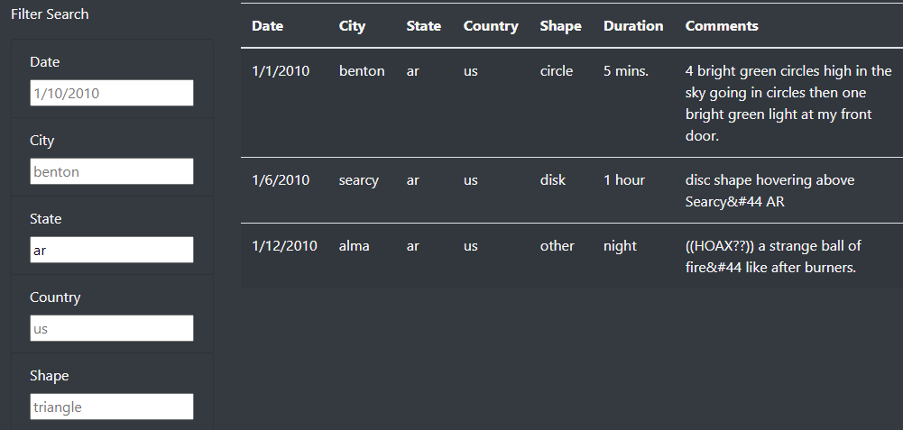
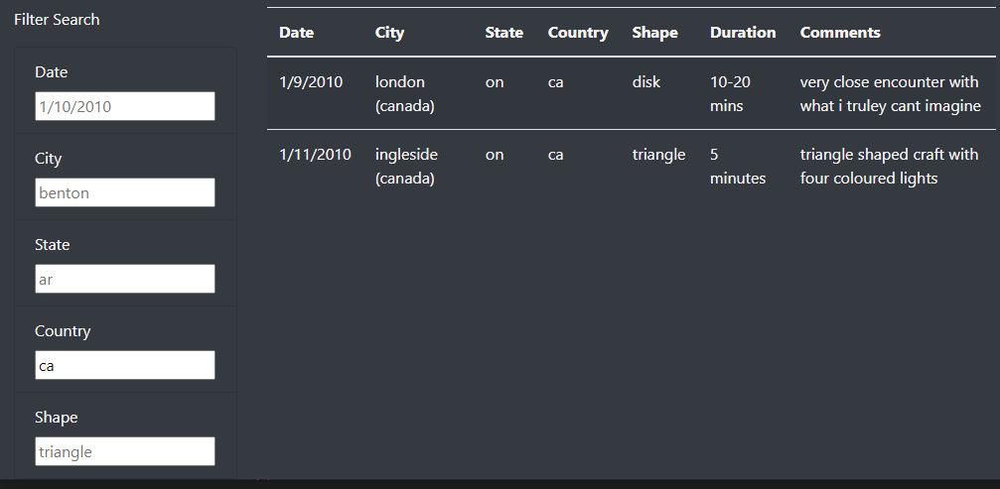

# Dynamic Display: UFO Sightings
## Overview
The purpose of this project is to create a dynamic webpage to allow users to quickly filter UFO sighting data to efficiently explore the dataset. This is accomplished using Javascript to display a dataset contained within the repository.

## Results
The webpage displays the UFO sighting data in a table, which can be updated using the fields on the lefthand side of the page. The page does not require a "Go" button to be clicked - the filters are applied when the input fields are modified, and then clicked out of.

A user might wish to view all sightings from Arkansas ("ar") in the data:

Or the user might wish to view all sightings from Canada ("ca") in the data:

## Summary
There are many ways to improve this page. 
These improvements could address drawbacks in its current design, such as:
* Displayed data is static
* The displayed data cannot be sorted within the page

Potential improvements to address these include:
* Integrate an API connection into this page, so that the data will be updated as new sightings are recorded
* Change the way the table is displayed, perhaps using some CSS magic to allow users to sort columns by clicking headers
